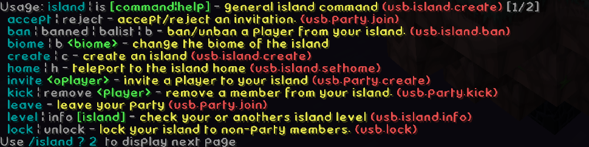
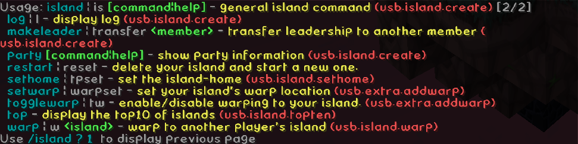
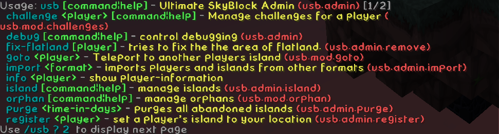
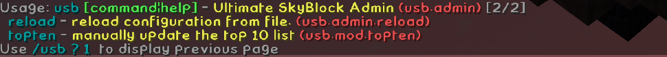

Commands in uSkyBlock is divided into 3 main categories 
* **/island** _the main island-menu_
* **/challenges** _completion of challenges_
* **/usb** _which controls access to most admin/mod-commands_

The first 2 will launch an inventory-based GUI, if invoked without arguments.

Common for all commands, when used without the UI, is tab-completion and the use of **/usb help** for displaying additional help.

 **/island** or one of it's alternative **/is**, **/sb** or **/skyblock**<br>
This is the main command, which will show a UI if invoked without arguments.

 **/challenge** or one of it's alternative **/challenges** or **/c**<br>
Displays current challenges, and supports completion of challenges.

This is a list of commands and their permissions 
```
Command                                        | Permission           | Description                                     
-----------------------------------------------+----------------------+-------------------------------------------------
/island|is                                     | usb.island.create    | general island command                          
/is accept|reject                              | usb.party.join       | accept/reject an invitation.                    
/is ban|unban <player>                         | usb.island.ban       | ban/unban a player from your island.            
/is biome|b <biome>                            |                      | change the biome of the island                  
/is create|c [schematic]                       | usb.island.create    | create an island                                
/is home|h                                     | usb.island.home      | teleport to the island home                     
/is info [island]                              | usb.island.info      | check your or anothers island info              
/is invite <oplayer>                           | usb.party.create     | invite a player to your island                  
/is kick|remove <player>                       | usb.party.kick       | remove a member from your island.               
/is leave                                      | usb.party.leave      | leave your party                                
/is level [island]                             | usb.island.level     | check your or anothers island level             
/is limits <player>                            | usb.island.limit     | show the islands limits                         
/is lock|unlock                                | usb.island.lock      | lock your island to non-party members.          
/is log|l                                      | usb.island.log       | display log                                     
/is makeleader|transfer <member>               | usb.island.makeleader| transfer leadership to another member           
/is party                                      | usb.island.create    | show party information                          
/is party info                                 |                      | shows information about your party              
/is party invites                              |                      | show pending invites                            
/is party uninvite <player>                    |                      | withdraw an invite                              
/is restart|reset [schematic]                  | usb.island.restart   | delete your island and start a new one.         
/is sethome|tpset                              | usb.island.sethome   | set the island-home                             
/is setwarp|warpset                            | usb.island.setwarp   | set your islands warp location                  
/is spawn                                      | usb.island.spawn     | teleports you to the skyblock spawn             
/is togglewarp|tw                              | usb.island.togglewarp| enable/disable warping to your island.          
/is top [page]                                 | usb.island.top       | display the top10 of islands                    
/is trust|untrust [player]                     | usb.island.trust     | trust/untrust a player to help on your island.  
/is warp|w <island>                            | usb.island.warp      | warp to another players island                  
-----------------------------------------------+----------------------+-------------------------------------------------
/islandtalk|istalk|it                          | usb.island.talk      | talk to players on your island                  
-----------------------------------------------+----------------------+-------------------------------------------------
/partytalk|ptalk|ptk                           | usb.party.talk       | talk to your island party                       
-----------------------------------------------+----------------------+-------------------------------------------------
/usb                                           | usb.admin            | Ultimate SkyBlock Admin                         
/usb challenge|ch <player>                     | usb.mod.challenges   | Manage challenges for a player                  
/usb ch <player> complete <challenge>          |                      | completes the challenge for the player          
/usb ch <player> rank <rank>                   |                      | complete all challenges in the rank             
/usb ch <player> reset <challenge>             |                      | resets the challenge for the player             
/usb ch <player> resetall                      |                      | resets all challenges for the player            
/usb config|c [config]                         | usb.admin.config     | open GUI for config                             
/usb cooldown|cd                               | usb.admin.cooldown   | Controls player-cooldowns                       
/usb cd clear|c <player> <command>             |                      | clears the cooldown on a command (* = all)      
/usb cd list|l [player]                        |                      | lists all the active cooldowns                  
/usb cd restart|r <player>                     |                      | restarts the cooldown on the command            
/usb debug                                     | usb.admin.debug      | control debugging                               
/usb debug enable|disable                      |                      | toggle debug-logging                            
/usb debug flush                               |                      | flush current content of the logger to file.    
/usb debug setlevel <level>                    |                      | set debug-level                                 
/usb doc [format]                              | usb.admin.doc        | saves documentation of the commands to a file   
/usb fix-flatland [player]                     | usb.admin.remove     | tries to fix the the area of flatland.          
/usb flush                                     | usb.admin.cache      | flushes all caches to files                     
/usb goto <player>                             | usb.mod.goto         | teleport to another players island              
/usb import <format>                           | usb.admin.import     | imports players and islands from other formats  
/usb info <player>                             | usb.admin.info       | show player-information                         
/usb island|is                                 |                      | manage islands                                  
/usb is addmember|add <player> [island]        | usb.admin.addmember  | adds the player to the island                   
/usb is delete [leader]                        | usb.admin.delete     | delete the island (removes the blocks)          
/usb is ignore <player>                        | usb.admin.ignore     | toggles the islands ignore status               
/usb is info <player>                          | usb.admin.info       | print out info about the island                 
/usb is makeleader|transfer <leader> <oplayer> | usb.admin.makeleader | transfer leadership to another player           
/usb is protect <player>                       | usb.mod.protect      | protects the island                             
/usb is protectall                             | usb.admin.protectall | protects all islands (time consuming)           
/usb is purge [leader]                         | usb.admin.purge      | purges the island                               
/usb is register <player>                      | usb.admin.register   | set a players island to your location           
/usb is remove <player>                        | usb.admin.remove     | removes the player from the island              
/usb is setbiome [leader] <biome>              | usb.admin.setbiome   | sets the biome of the island                    
/usb jobs|j                                    | usb.admin.jobs       | controls async jobs                             
/usb j stats|s                                 | usb.admin.jobs.stats | show statistics                                 
/usb lang|l <language>                         | usb.admin.lang       | changes the language of the plugin, and reloads 
/usb orphan                                    | usb.admin.orphan     | manage orphans                                  
/usb orphan clear                              |                      | clear orphans                                   
/usb orphan count                              |                      | count orphans                                   
/usb orphan list                               |                      | list orphans                                    
/usb perk                                      | usb.admin.perk       | shows perk-information                          
/usb perk list                                 |                      | lists all perks                                 
/usb perk player <player>                      |                      | shows a specific players perks                  
/usb purge <time-in-days>                      | usb.admin.purge      | purges all abandoned islands                    
/usb reload                                    | usb.admin.reload     | reload configuration from file.                 
/usb topten                                    | usb.mod.topten       | manually update the top 10 list                 
/usb version|v                                 | usb.admin.version    | displays version information                    
/usb wg                                        | usb.admin.wg         | various WorldGuard utilities                    
/usb wg load                                   |                      | load the region chunks                          
/usb wg refresh                                |                      | refreshes the chunks around the player          
/usb wg unload                                 |                      | load the region chunks                          
/usb wg update                                 |                      | update the WG regions                            
```
This file can be obtained with the command **/usb doc** (with _OP_ or when having the permission _usb.admin.doc_).

---

This is the old system to check for commands and permissions. This still works for a quick lookup while ingame.<br>
If invoked with arguments (i.e. `/is ?`) the below screendump is shown.

For player commands use **/is ?**



For admin and moderator commands use **/usb**


**Note:** _The permission-nodes are only shown to OPed users._